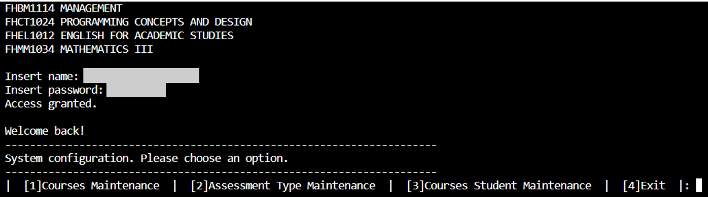
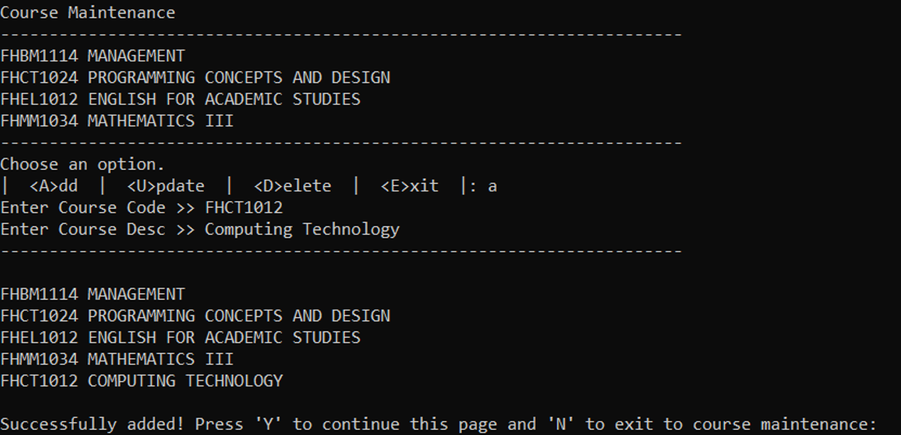
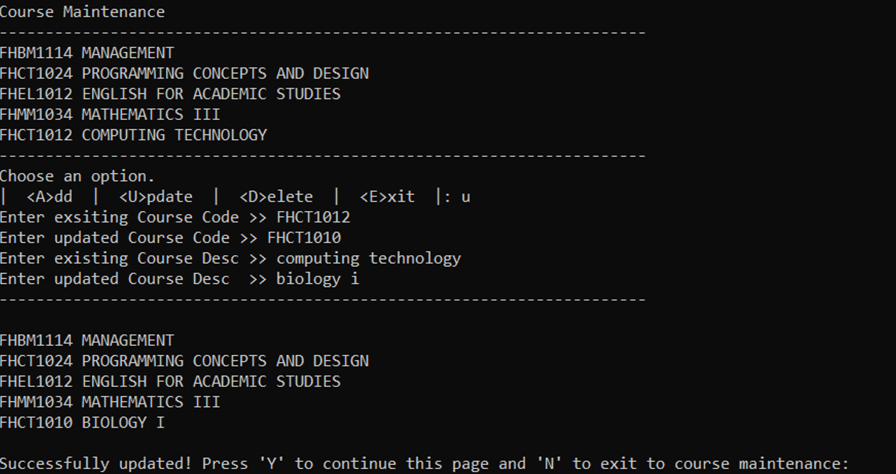
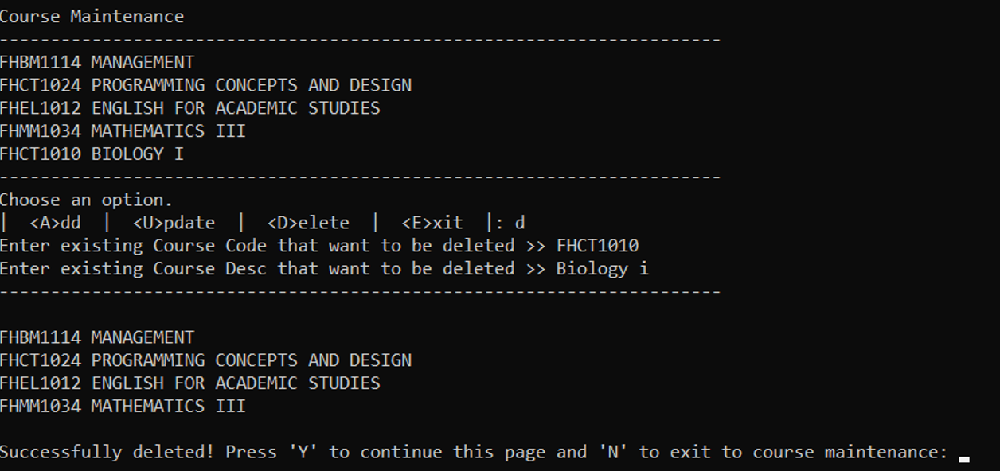
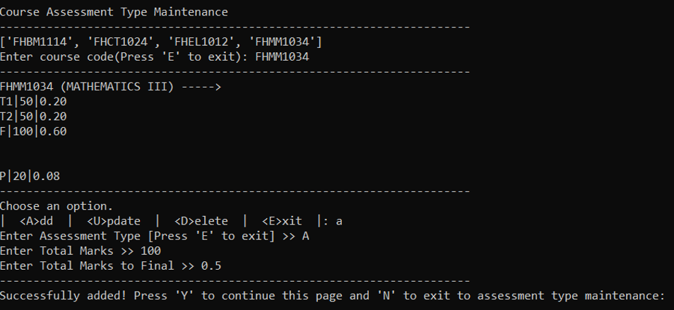
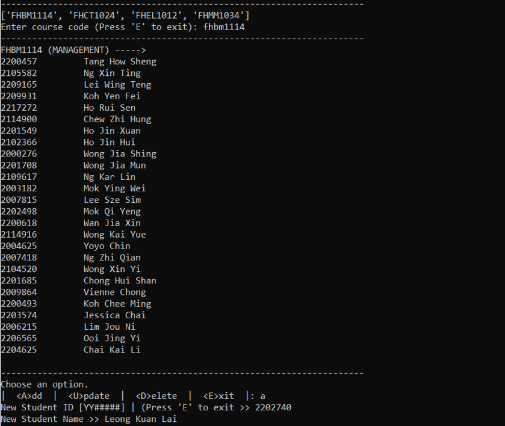
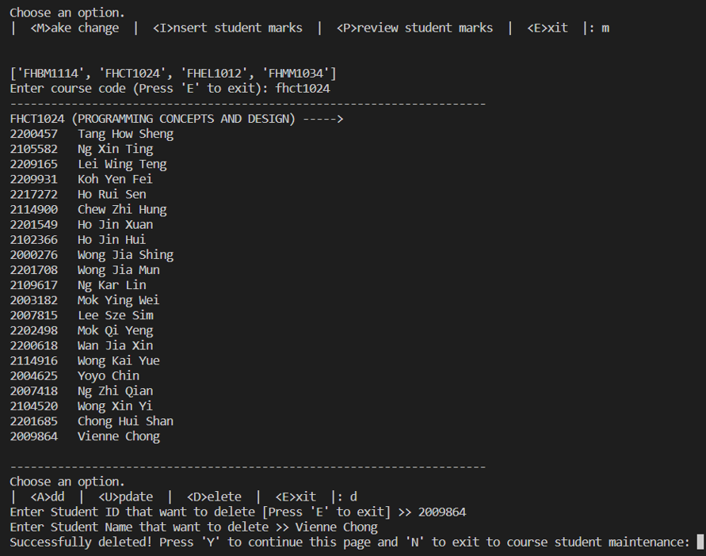
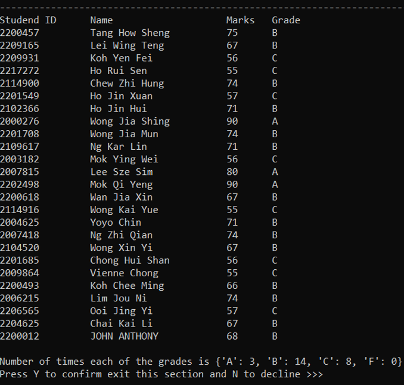

# 🎓 Student Result Management System

A Student Result Management System developed to manage students’ academic records and calculate course results efficiently. This system allows administrators or authorised users to manage courses, assessments, student information, marks, and generate result analysis reports.


- **Login Screen**



## 🎯 Project Objectives

- Simplify result calculation process
- Improve student record management
- Generate accurate performance analysis
- Provide maintainable and scalable academic system
- Reduce manual calculation errors


## 👥 User Roles

| Role | Permissions |
|---|---|
| Administrator | Manage courses, students, assessments, marks |
| Lecturer | Enter and update students’ marks |
| User | View results and reports |


## 📌 Features

### 📚 Course Management
- Add new courses
- View existing courses
- Update course information
- Delete courses

Each course contains:
- Course Code
- Course Description


### 📝 Assessment Management
- Add assessment types
- Update assessment details
- Delete assessments
- View assessment information

Assessment details include:
- Assessment Type
- Total Marks
- Weightage


### 👨‍🎓 Student Management
- Add student records
- Update student information
- Delete student records
- View student list

Student details include:
- Student ID
- Student Name


### 📊 Marks Management
- Enter students’ marks
- Store marks according to assessments
- Upload marks using `.txt` template files
- Calculate final course results automatically


### The system can:
- Compute students’ final grades
- Display students’ results based on course code
- Generate course performance analysis:
  - Average marks
  - Standard deviation
  - Failure rate
  - Grade distribution
  - Number of students for each grade


### 🔐 Authentication System
- Login system for authorised users
- Username and password authentication
- Prevent unauthorised access


## 📷 Screenshots
- **Course Maintenance Screen (Add Course)**


- **Course Maintenance Screen (Update Course)**


- **Course Maintenance Screen (Delete Course)**


- **Course Assessment Maintenance Screen (Add Course Assessment)**


- **Student Record Maintenance Screen (Add Student)**


- **Student Record Maintenance Screen (Delete Student)**



- **View Student Result Record Screen**


## ⚙️ Functionalities

### CRUD Operations
- Create records
- Read records
- Update records
- Delete records

### Result Calculation
- Automatic weighted mark calculation
- Grade generation
- Course-based result display

## 📂 Data Storage

All records are stored in text files:

```text
students.txt
courses.txt
assessments.txt
marks.txt
course_students.txt
```

## 🛠️ Technologies Used

- Programming Language: C++ / Java *(replace accordingly)*
- File Handling
- Object-Oriented Programming (OOP)
- Text File Storage


## 🚀 How to Run

1. Open the project in your IDE
   - Visual Studio
   - Eclipse
   - CodeBlocks
   - VS Code

2. Compile the source code

3. Run the program

4. Login using authorised credentials

